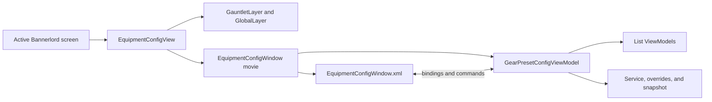
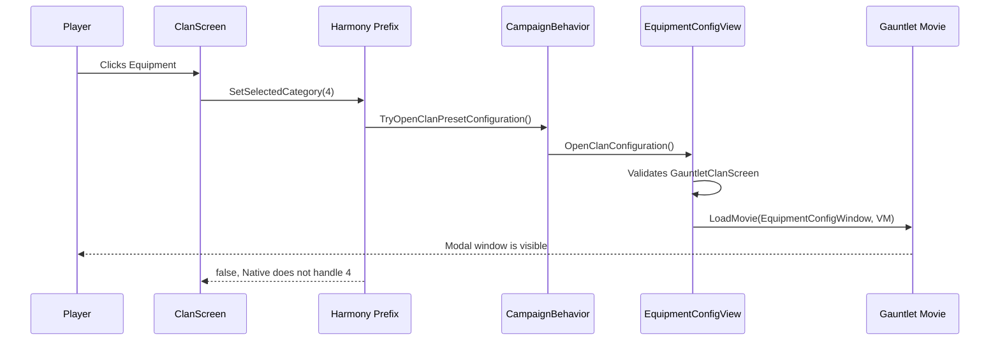
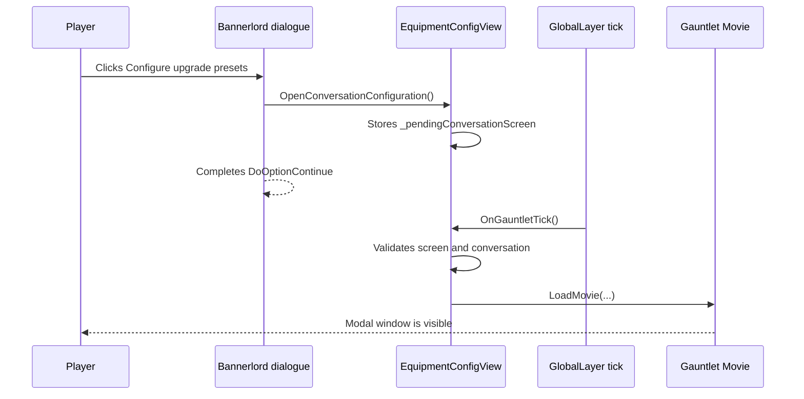
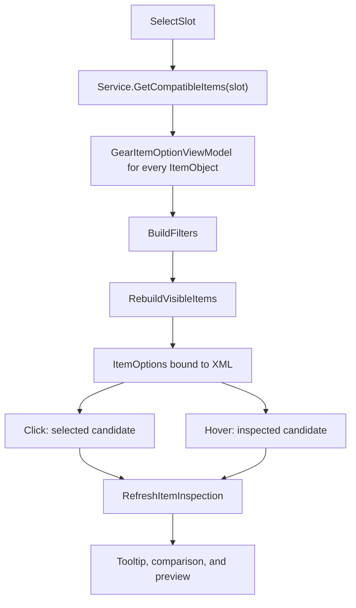

# UI Gauntlet Tutorial — Companion Gear Upgrades

> English version. [Version française](docs/README.fr.md) · [Project guide](docs/project-guide.md) · [Guide du projet en français](docs/project-guide.fr.md)

This document explains how the module UI actually works, from a Bannerlord click all the way to the ViewModel, XML prefab, and saveable snapshot. It is intended for a C# developer who is new to Gauntlet.

> For presets, dependencies, and full deployment instructions, also see the [project guide](docs/project-guide.md). This document focuses on understanding UI flows and knowing where to make changes without breaking their lifecycle.

## 1. The minimum mental model

Bannerlord splits the UI across several objects. This is not a C# window that creates its controls directly.

| Concept | Role in this module | Rough analogy |
| --- | --- | --- |
| `ScreenBase` | Active Bannerlord screen: Clan or conversation. | Host window/page. |
| `GauntletLayer` | Graphics layer above the screen that can take focus. | Modal overlay. |
| `GlobalLayer` | Container updated on every `ScreenManager` tick. | Global UI loop. |
| Gauntlet movie | Runtime instance of an XML prefab. | View created from a template. |
| XML prefab | Widget tree, brushes, bindings, and commands. | Declarative XAML/HTML. |
| `ViewModel` | C# state exposed to the prefab. | MVVM ViewModel. |
| `[DataSourceProperty]` | Makes a property readable from XML. | Bindable property. |
| `MBBindingList<T>` | Collection observable by Gauntlet. | `ObservableCollection<T>`. |
| `OnPropertyChanged(...)` | Tells Gauntlet to reread a changed property. | `INotifyPropertyChanged`. |

The main relationship is:



The XML does not contain business logic. It reads ViewModel properties and invokes commands. The ViewModel does not create widgets directly; it provides data and notifies Gauntlet when that data changes.

### What the module does not do

- It does not modify Native or SandBox XML files.
- It uses neither `InventoryScreenHelper` nor `SPInventoryVM`.
- It never stores a ViewModel or UI layer in a campaign save.
- It does not open the configurator automatically when a game starts.

## 2. Recommended code reading order

If you feel lost, start here, in this order:

1. [SubModule.cs](SubModule.cs): module startup and unload.
2. [CompanionGearUpgradeBehavior.cs](Behaviors/CompanionGearUpgradeBehavior.cs): creation of the service, overrides, and shared view.
3. [EquipmentConfigView.cs](UI/EquipmentConfigView.cs): movie creation, focus, host screen validity, and ticks.
4. [EquipmentConfigWindow.xml](GUI/Prefabs/EquipmentConfigWindow.xml): the widgets that are actually displayed.
5. [GearPresetConfigViewModel.cs](UI/GearPresetConfigViewModel.cs) and its partial files: window state and commands.
6. [UI/ViewModels](UI/ViewModels): list objects and tooltip state.
7. [GearPresetOverrides.cs](Data/GearPresetOverrides.cs) and [CompanionGearUpgradeService.cs](Services/CompanionGearUpgradeService.cs): persistence and hero application.

This order avoids two common mistakes: changing XML without knowing which ViewModel owns the data, or changing a ViewModel without knowing who creates and finalizes it.

## 3. Startup: who creates what?

### 3.1 Module loading

In [SubModule.cs](SubModule.cs):

1. `OnSubModuleLoad()` creates and enables UIExtenderEx, then applies the assembly Harmony patches.
2. `OnGameStart()` adds `CompanionGearUpgradeBehavior` to a campaign.
3. `OnGameEnd()` asks for configuration cleanup.
4. `OnSubModuleUnloaded()` deregisters UIExtenderEx and removes this module's patches.

UIExtenderEx is used here for the Clan prefab extension. The main movie itself is loaded explicitly by `GauntletLayer.LoadMovie("EquipmentConfigWindow", ...)` in `EquipmentConfigView`. Harmony intercepts the Clan category reserved for the module.

### 3.2 Session launch

`CompanionGearUpgradeBehavior.OnSessionLaunched()` builds the session objects:

```text
GearPresetRepository.BuildPresets()
        ↓
GearPresetOverrides (dictionaries restored through SyncData)
        ↓
CompanionGearUpgradeService
        ├── CompanionGearUpgradeDialog
        └── one EquipmentConfigView
```

The dialogue and Clan > Equipment therefore share the same service, the same override wrapper, and the same window. There are not two configurators to keep in sync.

`[CGU] Preset configuration is not ready yet.` more generally means that opening through the shared entry point failed: the view may not have been initialized after `OnSessionLaunched`, but the host screen, layer, or an active conversation may also be invalid. It does not mean that a preset is missing.

### 3.3 Ownership and lifetime

| Object | Owner | Lifetime | Important rule |
| --- | --- | --- | --- |
| `EquipmentConfigView` | `CompanionGearUpgradeBehavior` | Campaign session | One shared instance. |
| `GauntletLayer` and `EquipmentConfigGlobalLayer` | `EquipmentConfigView` | Session after `Initialize()` | The ViewModel never removes them. |
| `EquipmentConfigWindow` movie | `EquipmentConfigView` | One complete opening | Lazily created and released on the tick after close. |
| `GearPresetConfigViewModel` | `EquipmentConfigView`, attached to a movie | One complete opening | Do not retain it after `OnFinalize()`. |
| `ItemPreviewVM` | `GearPresetConfigViewModel` | One movie | One instance per movie, never per item row. |
| `_working` | `GearPresetConfigViewModel` | Editing one tier | Not persisted before Save. |

A useful general rule is that every level cleans up only what it owns. The ViewModel requests a state change; the host view controls focus and movie release.

## 4. The two opening flows

### 4.1 Clan > Equipment

The module does not replace the Clan screen. It adds a button through [ClanEquipmentTab.xml](GUI/PrefabExtensions/ClanEquipmentTab.xml), then reserves category `4`.



The files to follow are:

- [ClanEquipmentTabExtension.cs](UI/ClanEquipmentTabExtension.cs) loads and inserts the prefab through UIExtenderEx.
- [ClanEquipmentTabHarmonyPatch.cs](UI/ClanEquipmentTabHarmonyPatch.cs) patches `ClanManagementVM.SetSelectedCategory`.
- `TryOpenClanPresetConfiguration()` is the shared entry point.
- `EquipmentConfigView.OpenClanConfiguration()` rejects opening unless the current top screen is a `GauntletClanScreen`.

The patch returns `false` for category `4` so Native does not try to process a category that it does not own. For every other category it returns `true` and lets Native proceed normally.

### 4.2 Dialogue > Configure upgrade presets

In [CompanionGearUpgradeDialog.cs](Dialog/CompanionGearUpgradeDialog.cs), **Configure upgrade presets** calls `OpenPresetConfiguration()`, then `TryOpenConversationPresetConfiguration()`.

The important detail is that the movie is not loaded immediately.



Why wait one tick? The dialogue consequence callback runs while Bannerlord is still completing its internal transition. Taking focus immediately can create a blank window, lost focus, or intermittent opening. `_pendingConversationScreen` delays opening until the context is stable.

Do not create a second window or ViewModel for dialogue. Any new entry point must reuse `EquipmentConfigView`.

## 5. `EquipmentConfigView`: the Gauntlet host

[EquipmentConfigView.cs](UI/EquipmentConfigView.cs) is the boundary between Bannerlord and the configurator. It does not choose roles or items; it decides when the window may exist, become modal, and be released.

### 5.1 Initialization

`Initialize()`:

1. creates a `GauntletLayer` with priority `1000`;
2. creates `EquipmentConfigGlobalLayer`, whose tick calls `EquipmentConfigView.OnGauntletTick()`;
3. subscribes to `ScreenManager.OnPushScreen` and `OnPopScreen`;
4. adds the global layer to `ScreenManager`.

The layer exists throughout the campaign, but no movie is loaded until the player opens the configurator.

### 5.2 Movie creation

`OpenConfigurationInternal(...)` is the common method used by both entry points:

1. validates that the current screen is the expected host through `IsHostValid`;
2. records the host type: Clan or conversation;
3. creates `GearPresetConfigViewModel` if `_viewModel` is null;
4. loads the prefab through `LoadMovie("EquipmentConfigWindow", viewModel)`;
5. tells the ViewModel that the host screen is visible;
6. calls `viewModel.ExecuteOpenConfiguration()`.

If loading fails, the method finalizes any created ViewModel, releases any created movie, removes focus, and resets the host. This protection prevents a partially initialized modal layer from being left behind.

### 5.3 Modality and focus

The ViewModel receives an `Action<bool>` callback when it is created. When `IsWindowOpen` changes, the callback reaches `EquipmentConfigView.SetWindowLayerState(...)`, which:

- enables or resets input restrictions;
- turns the `GauntletLayer` into a focus layer or removes it as one;
- calls `ScreenManager.TrySetFocus` or `TryLoseFocus`;
- schedules movie release on the next tick when the window closes.

A window is modal only when:

```text
the host screen is still valid AND ViewModel.IsWindowOpen == true
```

If the player closes Clan, leaves the conversation, or opens another screen, `UpdateHostVisibility(...)` makes the host invisible. The ViewModel then closes the configuration and warns if an unsaved snapshot had to be discarded.

### 5.4 Correct close sequence

```text
ViewModel closes the window
        ↓
IsWindowOpen = false
        ↓
_releaseMovieOnNextTick = true
        ↓
next tick: ReleaseConfigurationMovie()
        ↓
ViewModel.OnFinalize()
        ↓
GauntletLayer.ReleaseMovie(movie)
```

Do not release the movie from a ViewModel command. Gauntlet may still use it during the current callback.

## 6. Reading XML as a binding contract

The main prefab is [EquipmentConfigWindow.xml](GUI/Prefabs/EquipmentConfigWindow.xml). Its name must remain the same as the one passed to `LoadMovie`: `EquipmentConfigWindow`.

A representative example is:

```xml
<ListPanel DataSource="{RoleOptions}">
  <ButtonWidget IsSelected="@IsSelected"
                Command.Click="ExecuteSelect"
                UpdateChildrenStates="true">
    <TextWidget Text="@Name" />
  </ButtonWidget>
</ListPanel>
```

| Expression | Meaning |
| --- | --- |
| `DataSource="{RoleOptions}"` | Read the `RoleOptions` collection from the root ViewModel. |
| `@Name` | Read `Name` from the current list element. |
| `@IsSelected` | Read the state of that element. |
| `Command.Click="ExecuteSelect"` | Invoke the public command on the current element. |
| `UpdateChildrenStates="true"` | Propagate button visual state to child widgets. |

A bound property must be exposed and notified:

```csharp
[DataSourceProperty]
public bool IsSelected
{
    get { return _isSelected; }
    private set
    {
        if (_isSelected == value)
            return;

        _isSelected = value;
        OnPropertyChanged(nameof(IsSelected));
    }
}
```

Without `[DataSourceProperty]`, Gauntlet cannot read the value. Without `OnPropertyChanged`, the UI can retain an old value after a mutation.

Visible collections use `MBBindingList<T>`, not `List<T>`, so Gauntlet observes additions and removals.

### 6.1 Why interactive elements are `ButtonWidget`

Filters, sorting controls, and item rows must be real buttons:

```text
ButtonType="Radio"
IsSelected="@IsSelected"
DominantSelectedState="true"
UpdateChildrenStates="true"
```

Those properties allow built-in Bannerlord brushes to handle normal, hovered, pressed, and selected states. A `BrushWidget` on its own is visual, not interactive.

`DoNotPassEventsToChildren="true"` also ensures that row labels and icons do not consume the click: the entire row remains clickable.

## 7. Navigation: a simple state machine

The root ViewModel contains a private `Page` enum:

```text
Roles → Tiers → Categories → Slots → Items
```

The XML does not bind directly to that enum. It reads calculated properties instead:

```text
IsRoleSelectionVisible
IsTierSelectionVisible
IsCategorySelectionVisible
IsSlotSelectionVisible
IsItemSelectionVisible
```

`SetPage(...)` changes the page and calls `NotifyPageChanged()`. That method notifies Gauntlet about visibility, breadcrumb, and price changes. When leaving Items, it also clears item inspection and its associated preview.

### 7.1 Detailed navigation flow

| User action | Method | Important effect |
| --- | --- | --- |
| Click a role | `SelectRole` | Marks the role, rebuilds tiers 1 through 3, and moves to Tiers. |
| Click a tier | `SelectTier` then `LoadTier` | For a new role/tier, creates the effective snapshot or confirms discarding a dirty snapshot; for the same already loaded role/tier, simply returns to Categories. |
| Click a category | `SelectCategory` | Builds the Weapons, Armors, or Horse slots. |
| Click a slot | `SelectSlot` | Loads the compatible catalog, filters, and visible list, then moves to Items. |
| Click Back | `ExecuteBack` | Goes to the previous page; from Roles, starts Exit. |

Slot order, stable names, grouping, and compatible item types are centralized in [GearSlotCatalog.cs](Domain/GearSlotCatalog.cs). [GearPresetConfigViewModel.Formatting.cs](UI/GearPresetConfigViewModel.Formatting.cs) only projects that catalogue into UI categories:

| Category | Slots |
| --- | --- |
| Weapons | `Weapon0`, `Weapon1`, `Weapon2`, `Weapon3` |
| Armors | `Head`, `Body`, `Cape`, `Gloves`, `Leg` |
| Horse | `Horse`, `HorseHarness` |

`GetSlotName()` delegates to the catalogue's explicit stable name. Do not replace export names with `EquipmentIndex.ToString()`: those names are part of JSON schema v1.

The roles, the three tiers, and the three categories are explicitly constructed by the current code. A fourth tier is not discovered automatically: the repository, UI options, and dialogue lines must be updated together.

### 7.2 The snapshot: buffer between UI and persistence

When a new role/tier is loaded, `LoadTier(...)` creates:

| Field | Contents | Lifetime |
| --- | --- | --- |
| `_working` | Editable temporary snapshot of the effective preset. | Editing one tier. |
| `_savedSnapshot` | Reference copy used to detect a diff. | Editing one tier. |
| `_workingRole`, `_workingTier` | Identity of the current snapshot. | Editing one tier. |

The effective snapshot is produced as follows:

```text
default preset
        +
persisted overrides
        =
snapshot displayed and edited by the UI
```

`GearPresetOverrides.CaptureSnapshot(...)` starts by copying the default preset, then applies persisted differences. The editor never changes defaults.

Until the user clicks Save, Select, Remove, Reset, and price actions change only `_working`.

`SnapshotsEqual(...)` compares cost, key presence, and `StringId` values for every editable slot. A missing key differs from a key present with `null`: this distinction preserves the meaning of an explicitly cleared slot.

## 8. ViewModels: who does what?

### 8.1 The main ViewModel split into files

`GearPresetConfigViewModel` is one `partial` class, not several independent ViewModels. The files share the same private fields and only separate responsibilities:

| File | Responsibility |
| --- | --- |
| [GearPresetConfigViewModel.cs](UI/GearPresetConfigViewModel.cs) | Root state, Save/Exit commands, price actions, and default snapshot. |
| [GearPresetConfigViewModel.Navigation.cs](UI/GearPresetConfigViewModel.Navigation.cs) | Role, tier, category, and slot. |
| [GearPresetConfigViewModel.Items.cs](UI/GearPresetConfigViewModel.Items.cs) | Catalog, filters, search, sort, click, hover, and inspection. |
| [GearPresetConfigViewModel.State.cs](UI/GearPresetConfigViewModel.State.cs) | Pages, notifications, slot labels, and dirty state. |
| [GearPresetConfigViewModel.Preview.cs](UI/GearPresetConfigViewModel.Preview.cs) | 3D preview state machine. |
| [GearPresetConfigViewModel.Formatting.cs](UI/GearPresetConfigViewModel.Formatting.cs) | Names, categories, labels, and hints. |

This organization lets you find an issue by responsibility without losing the fact that state belongs to one instance.

### 8.2 Small list ViewModels

| Class | Represents | Main command |
| --- | --- | --- |
| `GearRoleOptionViewModel` | One role. | `ExecuteSelect` |
| `GearTierOptionViewModel` | One tier and its cost. | `ExecuteSelect` |
| `GearCategoryOptionViewModel` | Weapons, Armors, or Horse. | `ExecuteSelect` |
| `GearSlotOptionViewModel` | One slot with its current label. | `ExecuteSelect` |
| `GearItemFilterOptionViewModel` | One item-type filter. | `ExecuteSelect` |
| `GearItemSortOptionViewModel` | One price order. | `ExecuteSelect` |
| `GearItemOptionViewModel` | One catalog row. | Click and hover. |
| `GearItemTooltipViewModel` | One statistics sheet. | Provides rows, no command. |

Options receive a callback from the parent ViewModel. The conceptual flow is:

```text
role row click
    → GearRoleOptionViewModel.ExecuteSelect()
    → SelectRole(option) callback on the main ViewModel
    → parent updates every option and navigation
```

The small ViewModel therefore knows its label and visual state; the parent remains the only component that knows the service, snapshot, and the rest of navigation.

## 9. Full Items page flow

The Items page combines catalog, filters, search, selection, hover, tooltip, comparison, and preview.



### 9.1 Building and filtering the catalog

`SelectSlot(...)` calls `CompanionGearUpgradeService.GetCompatibleItems(slot)`. The service enumerates Bannerlord-registered `ItemObject` instances and keeps only types allowed for the slot. It does not contain search, sorting, or visual state.

Examples:

| Slot | Allowed types |
| --- | --- |
| `Weapon0` through `Weapon3` | Compatible weapons, bows, crossbows, thrown weapons, shields, ammunition, and banners. |
| `Head` | `HeadArmor` only. |
| `Body` | `BodyArmor` only. |
| `Horse` | `Horse` only. |
| `HorseHarness` | `HorseHarness` only. |

`BuildFilters()` always creates **All**, then the types present in the catalog. `RebuildVisibleItems()` then applies:

1. the active type filter;
2. case-insensitive search across name and `StringId`;
3. ascending or descending price sorting;
4. name and `StringId` tie-breaking for a stable order.

Mod items can appear if they are registered as `ItemObject` and have an allowed type.

### 9.2 Click, candidate, and configured item

These three states are different:

| State | Data | How it changes |
| --- | --- | --- |
| Configured item | `_working.Slots[_slot]` | **Select** or **Remove**. |
| Selected candidate | `_selectedCandidateId` | Clicking a row. |
| Hovered item | `_hoveredCandidate` | Pointer entering/leaving a row. |

Clicking a row calls `GearItemOptionViewModel.ExecuteHighlight()` then `HighlightCandidate(...)`. It selects only a candidate; the temporary equipment has not changed yet.

**Select** calls `ExecuteSelectItem()`:

```text
_working.Slots[_slot] = _selectedCandidateId
```

**Remove** calls `ExecuteRemoveItem()`:

```text
_working.Slots[_slot] = null
```

Both commands stay on Items. They also call `SetSelectedCandidate(null)`: the candidate visual state is deliberately cleared, then tooltip and preview fall back to the configured item or the next hover. `null` is intentional: Save converts it into `__CGU_EMPTY_SLOT__`, which distinguishes an explicitly cleared slot from a missing override.

## 10. Tooltip and comparison

The central method is `RefreshItemInspection()` in [GearPresetConfigViewModel.Items.cs](UI/GearPresetConfigViewModel.Items.cs).

Inspection priority is always:

```text
hovered item
    otherwise selected candidate
        otherwise configured item
            otherwise no tooltip
```

`HasInspectionItem` depends only on the item that is actually inspected. It does not depend on comparison or the presence of a configured item.

| Situation | Result |
| --- | --- |
| Empty slot + hover or selection | Full single sheet for that item. |
| Hover equals configured item | One sheet. |
| Hover equals selected candidate | One sheet. |
| Configured item + hover differs from it and from the selected candidate | Hovered / Configured comparison. |
| Hover ends | Fall back to selected candidate, otherwise configured item. |

Comparison is optional. It must never be required to obtain statistics for a selected candidate.

`GearItemTooltipViewModel` builds rows through `ItemMenuTooltipPropertyVM`, without creating the built-in inventory screen. It provides type, tier, value, weight, and relevant armor, horse, or weapon statistics.

## 11. 3D preview: why it depends on a tick

The preview needs a live native widget. The XML contains an `ItemTableauWidget` with this exact ID:

```text
CGUPreviewTableau
```

Calling `ItemPreviewVM.Open()` directly from a click or constructor is an anti-pattern: the movie can exist before the widget's `TextureProvider` is ready. That is the usual cause of a blank preview on the first opening.

The real flow is:

1. `RefreshItemInspection()` finds the inspected item and calls `SetPreviewItem(item)`.
2. `EquipmentConfigView.OnGauntletTick()` finds `CGUPreviewTableau` in the live widget tree.
3. It verifies that the widget is connected to the root, visible, and has a `TextureProvider`.
4. It passes host-ready and texture-ready indicators to the ViewModel.
5. `GearPresetConfigViewModel.OnGauntletTick(...)` waits for the configured delay, clears the prior tableau, then calls `ItemPreviewVM.Open()`.
6. The ViewModel waits for stabilization and a valid native texture before declaring the preview ready.
7. After an exception or a texture wait that is too long, it performs at most three attempts in total, including the initial attempt.

| Field | Role |
| --- | --- |
| `_requestedPreviewItemId` | Item the UI wants to show. |
| `_openedPreviewItemId` | Item for which `Open()` has already run. |
| `_readyPreviewItemId` | Item whose texture is actually ready. |
| `_previewOpenAttempt` | Total number of attempts. |

When leaving Items or closing the window, the tableau is closed and cleared. `ItemPreviewVM.OnFinalize()` is called only during final movie release in `GearPresetConfigViewModel.OnFinalize()`.

## 12. Save, Exit, and persistence from the UI perspective

Persistence lives outside XML, but it explains why the ViewModel is separated from campaign data.

### 12.1 Save

On the Categories page, **Save** calls `ExecuteSave()`:

```text
_working snapshot
        ↓
GearPresetOverrides.CommitSnapshot(...)
        ↓
CampaignBehavior dictionaries
        ↓
_savedSnapshot becomes a copy of _working
        ↓
Later, when the campaign is saved, `SyncData` serializes the dictionaries
```

Save does not close the window. It saves only the current tier. The in-memory dictionaries become durable on disk when Bannerlord saves the campaign.

`GearPresetOverrides` is a wrapper over the `CampaignBehavior` dictionaries. Do not replace it with a local copy if you want persistence to remain connected to the campaign session.

### 12.2 Exit and dirty tiers

`ExecuteExit()` compares `_working` and `_savedSnapshot`:

- if they are equal, the window closes immediately;
- otherwise, `InformationManager.ShowInquiry(...)` offers to discard changes or continue editing.

When the user changes tier with an unsaved snapshot, `SelectTier()` applies the same protection before loading another preset.

**Save** is visible only on the Categories page. **Exit** remains in the footer so the user can close configuration from any page. **Select** and **Remove** are specific to Items and do not leave it.

### 12.3 Reset and price

Categories-page actions change only the snapshot:

- **Reset this tier to default** creates a copy of the default preset.
- **Set price (gold)** validates a non-negative integer and replaces the snapshot.
- **Calculate from equipment** sums configured item values and offers that amount as the tier price.

The rule to remember is: **the UI changes `_working`, Save commits overrides, and the service applies equipment to the hero.**

## 13. From override to upgrade: connection to business logic

The application flow is not executed by the configuration window. Dialogue tier lines call `CompanionGearUpgradeService.TryApplyTier(role, tier)`.

The service:

1. validates the conversation hero and the player hero's gold;
2. builds the effective snapshot from defaults plus overrides;
3. resolves every `StringId` before any mutation;
4. clones battle equipment;
5. returns changed old items to `MobileParty.MainParty` when possible;
6. writes every editable slot, including missing or `null` slots that must be empty;
7. removes gold and assigns the new equipment.

The important UI detail is that `GearSlotCatalog.EditableSlots` drives capture, commit, transfer, and application. Do not duplicate that rule in a ViewModel or persistence class.

## 14. Debugging a UI flow

### 14.1 Useful breakpoints

| Symptom | First breakpoint | Then follow |
| --- | --- | --- |
| Equipment button does nothing | `ClanEquipmentTabHarmonyPatch.Prefix` | `TryOpenClanPresetConfiguration`, then `OpenClanConfiguration`. |
| Dialogue does not open | `CompanionGearUpgradeDialog.OpenPresetConfiguration` | `OpenConversationConfiguration`, then the global tick. |
| Movie is invisible | `OpenConfigurationInternal` | `LoadMovie`, recorded host, possible catch. |
| List is empty | `SelectSlot` | `GetCompatibleItems`, `BuildFilters`, `RebuildVisibleItems`. |
| Row click has no effect | `GearItemOptionViewModel.ExecuteHighlight` | `HighlightCandidate`, `_selectedCandidateId`. |
| Tooltip is missing | `RefreshItemInspection` | Hover, candidate, configured item, `_inspectedItem`. |
| Preview is blank | `EquipmentConfigView.OnGauntletTick` | `CGUPreviewTableau`, `TextureProvider`, ViewModel tick. |
| Window closes | `SetHostScreenVisible` | `UpdateHostVisibility`, `ScreenManager.TopScreen`. |

### 14.2 When a binding looks broken

Use this checklist:

1. Does the XML name exactly match the C# name? `@ItemName` looks for `ItemName` on the current DataSource.
2. Does the property have `[DataSourceProperty]`?
3. Does the mutation call `OnPropertyChanged(nameof(...))`?
4. Is the widget in the root DataSource or in a list `ItemTemplate`?
5. Does the command target the intended ViewModel? In a list, `ExecuteSelect` usually targets the current element.
6. Is the deployed XML actually the source XML you changed? A build does not copy prefabs automatically.

### 14.3 When focus is strange

Check these first:

```text
_host
_hostScreen
ScreenManager.TopScreen
_isHostScreenVisible
_isLayerModal
```

A focus issue nearly always comes from a host that is no longer the `TopScreen`, an opening that occurs too early during dialogue, or a movie released at the wrong time.

## 15. Safe extension recipes

### 15.1 Add data to an item row

1. Add the data to `GearItemOptionViewModel`.
2. Expose it through `[DataSourceProperty]`.
3. Call `OnPropertyChanged` if it can change after construction.
4. Bind it in the `ItemOptions` template through `@MyProperty`.
5. Verify that the DataSource is the row's `GearItemOptionViewModel`.

Prepare data in the ViewModel. Do not add an unnecessary expensive `MBObjectManager` lookup to a property read frequently by XML.

### 15.2 Add a filter

Change `BuildFilters()` and, if necessary, `GetOrderedItemTypeNames()`. Preserve this flow:

```text
filter click
    → SelectFilter
    → update IsSelected on every filter
    → RebuildVisibleItems
    → RefreshItemInspection
```

The flow first clears hover; the final refresh recalculates tooltip/preview priority. The selected candidate is intentionally retained even if a filter or search hides its row from `ItemOptions`: `FindCandidate` can still find it in `_allItems`.

### 15.3 Add a slot or category

To add a **slot**, define its order, stable JSON name, category, and compatible item type once in `GearSlotCatalog`, then update default presets and empty-slot tests as needed. Because schema v1 requires every supported slot explicitly, changing that set also requires a deliberate transfer-schema version change.

To add a **category**, also add:

1. a value to `GearPresetCategory` in [GearPresetConfigTypes.cs](UI/GearPresetConfigTypes.cs);
2. its option in `LoadTier()`; the three current categories are hardcoded there;
3. an explicit case in `GetSlotsForCategory()`; its current `default` returns Horse slots;
4. the category brush in `GearCategoryOptionViewModel.GetIconBrush()`; its `default` uses the mounts brush.

Missing any one of these points often creates an option that is visible but not correctly saved or applied.

### 15.4 Add a page

To add a new configuration page:

1. add a value to the private `Page` enum;
2. expose `IsMyPageVisible` through `[DataSourceProperty]`;
3. notify it from `IsWindowOpen` and `NotifyPageChanged()`;
4. add the XML widget with `IsVisible="@IsMyPageVisible"`;
5. always navigate through `SetPage(...)`;
6. update `ExecuteBack()` and `Breadcrumb`;
7. update the XML footer if the page needs Save; Save is currently visible only with `IsCategorySelectionVisible`;
8. explicitly define any cleanup needed when leaving the page. Existing automatic cleanup is specific to leaving Items.

### 15.5 Add a C# file

This is a classic `.csproj`: every C# file is explicitly listed. After creating a class, add it to `<Compile Include="...">` in [CompanionGearUpgrade.csproj](CompanionGearUpgrade.csproj), otherwise it will not compile.

## 16. Rules not to break

- Do not modify Native or SandBox; keep using the prefab extension.
- Do not create a second `EquipmentConfigView` from dialogue.
- Do not call `ItemPreviewVM.Open()` before the Gauntlet context is ready.
- Do not make comparison necessary to display statistics.
- Do not turn an explicitly cleared slot into a simple missing override.
- Do not commit data directly from an item row; use `_working`, then Save.
- Do not copy Harmony or UIExtenderEx into the module.
- Add every new C# class to the `.csproj`.

## 17. Manual test flow

After a UI change, test in this order:

1. Load a campaign: no window should open automatically.
2. Open **Clan > Equipment**: verify opening and modal focus.
3. Open **Configure upgrade presets** from a companion dialogue: verify it opens the same window.
4. Navigate role → tier → category → slot → items, then return with Back.
5. Change filter, search, and sort: one active filter and one active sort order should each remain visible. An item candidate can stay selected in memory while its row is hidden by filtering or search.
6. Click a full row, then Select: the snapshot must change without leaving Items.
7. Remove an item, then hover another: its statistics must appear even with an empty slot.
8. Configure an item, then hover a different unselected item: verify the two-column comparison.
9. Open the first Items list: preview must load without leaving the window.
10. Save: the window remains open. Make another unsaved change, then Exit: the discard confirmation must appear.
11. Save the campaign, reload it, and verify an explicitly cleared slot.

## 18. When you are lost, trace the chain upward

For any visual behavior, ask these questions in order:

```text
Which XML widget receives the action?
        ↓
Which ViewModel is its current DataSource?
        ↓
Which command or property is invoked or read?
        ↓
Who changes that property and calls OnPropertyChanged?
        ↓
Which snapshot, service, or override is behind it?
        ↓
Who owns the object and when is it finalized?
```

With that chain, Gauntlet becomes fairly standard MVVM. The key difference is that Bannerlord controls the lifecycle of screens, layers, and native widgets, so the module UI must always respect that context.
