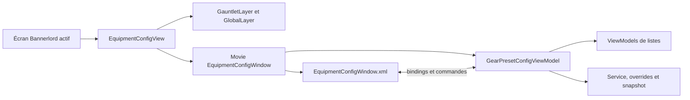
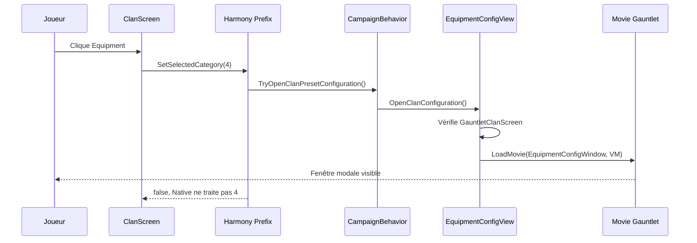
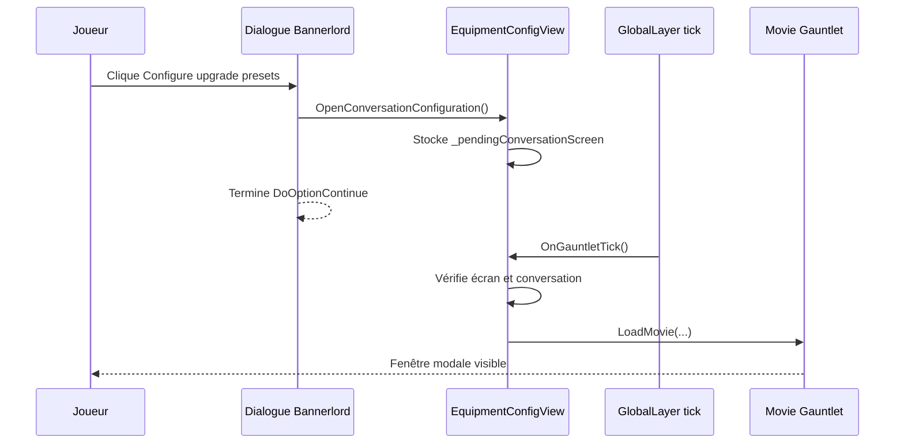
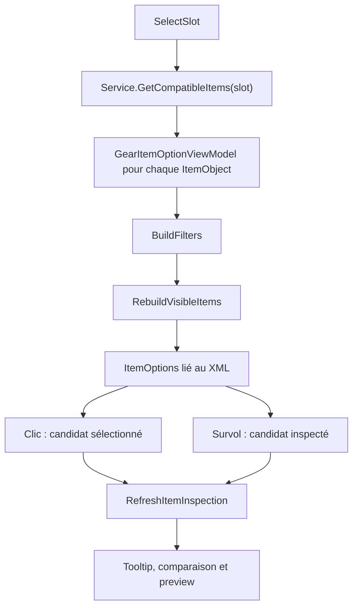

# Tutoriel UI Gauntlet — Companion Gear Upgrades

> Version française. [English UI tutorial](../README.md) · [English project guide](project-guide.md) · [Guide du projet en français](project-guide.fr.md)

Ce document explique le fonctionnement réel de l’interface du module, depuis un clic dans Bannerlord jusqu’au ViewModel, au prefab XML et au snapshot sauvegardable. Il vise un développeur C# qui découvre Gauntlet.

> Pour les presets, les dépendances et le déploiement complet, voir aussi le [guide du projet en français](project-guide.fr.md). Ici, l’objectif est surtout de comprendre les flows UI et de savoir où intervenir sans casser leur cycle de vie.

## 1. Le modèle mental minimal

Bannerlord répartit l’interface entre plusieurs objets. Il ne s’agit pas d’une fenêtre C# qui crée directement ses contrôles.

| Concept | Rôle dans ce module | Analogie approximative |
| --- | --- | --- |
| `ScreenBase` | Écran Bannerlord actif : Clan ou conversation. | Fenêtre/page hôte. |
| `GauntletLayer` | Couche graphique placée au-dessus de l’écran et capable de prendre le focus. | Overlay modal. |
| `GlobalLayer` | Conteneur mis à jour à chaque tick par `ScreenManager`. | Boucle d’UI globale. |
| Movie Gauntlet | Instance runtime d’un prefab XML. | Vue instanciée depuis un template. |
| Prefab XML | Arbre des widgets, brushes, bindings et commandes. | XAML/HTML déclaratif. |
| `ViewModel` | État C# exposé au prefab. | ViewModel MVVM. |
| `[DataSourceProperty]` | Rend une propriété lisible depuis le XML. | Propriété bindable. |
| `MBBindingList<T>` | Collection observable par Gauntlet. | `ObservableCollection<T>`. |
| `OnPropertyChanged(...)` | Demande à Gauntlet de relire une propriété modifiée. | `INotifyPropertyChanged`. |

La relation principale est la suivante :



Le XML ne contient pas la logique métier. Il lit des propriétés du ViewModel et appelle des commandes. Le ViewModel ne crée pas directement les widgets ; il fournit des données et notifie Gauntlet quand elles changent.

### Ce que le module ne fait pas

- Il ne modifie pas les XML de Native ou SandBox.
- Il n’utilise ni `InventoryScreenHelper` ni `SPInventoryVM`.
- Il ne sauvegarde jamais un ViewModel ou une couche UI dans la campagne.
- Il n’ouvre pas le configurateur automatiquement au lancement d’une partie.

## 2. Ordre conseillé pour lire le code

Si vous êtes perdu, commencez ici, dans cet ordre :

1. [SubModule.cs](../SubModule.cs) : démarrage et déchargement du module.
2. [CompanionGearUpgradeBehavior.cs](../Behaviors/CompanionGearUpgradeBehavior.cs) : création du service, des overrides et de la vue partagée.
3. [EquipmentConfigView.cs](../UI/EquipmentConfigView.cs) : création du movie, focus, validité de l’écran hôte et tick.
4. [EquipmentConfigWindow.xml](../GUI/Prefabs/EquipmentConfigWindow.xml) : widgets réellement affichés.
5. [GearPresetConfigViewModel.cs](../UI/GearPresetConfigViewModel.cs) et ses fichiers partiels : état et commandes de la fenêtre.
6. [UI/ViewModels](../UI/ViewModels) : objets des listes et tooltip.
7. [GearPresetOverrides.cs](../Data/GearPresetOverrides.cs) et [CompanionGearUpgradeService.cs](../Services/CompanionGearUpgradeService.cs) : persistance et application au héros.

Cette méthode de lecture évite deux erreurs courantes : modifier le XML sans savoir quel ViewModel possède la donnée, ou modifier un ViewModel sans savoir qui le crée et le finalise.

## 3. Démarrage : qui crée quoi ?

### 3.1 Chargement du module

Dans [SubModule.cs](../SubModule.cs) :

1. `OnSubModuleLoad()` crée et active UIExtenderEx, puis applique les patches Harmony de l’assembly.
2. `OnGameStart()` ajoute `CompanionGearUpgradeBehavior` à une campagne.
3. `OnGameEnd()` demande la libération de la configuration.
4. `OnSubModuleUnloaded()` désenregistre UIExtenderEx et enlève les patches du module.

UIExtenderEx sert ici à l’extension du prefab Clan. Le movie principal est chargé explicitement par `GauntletLayer.LoadMovie("EquipmentConfigWindow", ...)` dans `EquipmentConfigView`. Harmony intercepte la catégorie Clan réservée au module.

### 3.2 Lancement de session

`CompanionGearUpgradeBehavior.OnSessionLaunched()` construit les objets de session :

```text
GearPresetRepository.BuildPresets()
        ↓
GearPresetOverrides (dictionnaires restaurés par SyncData)
        ↓
CompanionGearUpgradeService
        ├── CompanionGearUpgradeDialog
        └── EquipmentConfigView unique
```

Le dialogue et Clan > Equipment partagent donc le même service, la même façade d’overrides et la même fenêtre. Il n’existe pas deux configurateurs à synchroniser.

Le message `[CGU] Preset configuration is not ready yet.` signifie plus généralement que l’ouverture partagée a échoué : la vue peut ne pas être initialisée après `OnSessionLaunched`, mais l’écran hôte, la couche ou une conversation active peuvent aussi être invalides. Il ne signifie pas qu’un preset est manquant.

### 3.3 Ownership et durée de vie

| Objet | Propriétaire | Durée de vie | Règle importante |
| --- | --- | --- | --- |
| `EquipmentConfigView` | `CompanionGearUpgradeBehavior` | Session de campagne | Une seule instance partagée. |
| `GauntletLayer` et `EquipmentConfigGlobalLayer` | `EquipmentConfigView` | Session après `Initialize()` | Le ViewModel ne les retire jamais. |
| Movie `EquipmentConfigWindow` | `EquipmentConfigView` | Une ouverture complète | Créé paresseusement et libéré au tick suivant de la fermeture. |
| `GearPresetConfigViewModel` | `EquipmentConfigView`, lié à un movie | Une ouverture complète | Ne pas le conserver après `OnFinalize()`. |
| `ItemPreviewVM` | `GearPresetConfigViewModel` | Un movie | Une instance par movie, pas par ligne d’objet. |
| `_working` | `GearPresetConfigViewModel` | Édition d’un tier | N’est pas persisté avant Save. |

Une bonne règle générale : chaque niveau nettoie uniquement ce qu’il possède. Le ViewModel demande un changement d’état ; la vue hôte décide du focus et de la libération du movie.

## 4. Les deux flows d’ouverture

### 4.1 Clan > Equipment

Le module ne remplace pas l’écran Clan. Il ajoute un bouton via [ClanEquipmentTab.xml](../GUI/PrefabExtensions/ClanEquipmentTab.xml), puis réserve la catégorie `4`.



Les fichiers à suivre sont :

- [ClanEquipmentTabExtension.cs](../UI/ClanEquipmentTabExtension.cs) charge et insère le prefab via UIExtenderEx ;
- [ClanEquipmentTabHarmonyPatch.cs](../UI/ClanEquipmentTabHarmonyPatch.cs) patche `ClanManagementVM.SetSelectedCategory` ;
- `TryOpenClanPresetConfiguration()` est le point d’entrée partagé ;
- `EquipmentConfigView.OpenClanConfiguration()` refuse l’ouverture si l’écran supérieur n’est pas un `GauntletClanScreen`.

Le patch retourne `false` pour la catégorie `4`, afin que Native ne tente pas de traiter une catégorie qu’il ne possède pas. Pour les autres catégories, il retourne `true` et laisse Native fonctionner normalement.

### 4.2 Dialogue > Configure upgrade presets

Dans [CompanionGearUpgradeDialog.cs](../Dialog/CompanionGearUpgradeDialog.cs), la ligne **Configure upgrade presets** appelle `OpenPresetConfiguration()`, puis `TryOpenConversationPresetConfiguration()`.

Le point subtil : le movie n’est pas chargé immédiatement.



Pourquoi attendre un tick ? La conséquence du dialogue s’exécute alors que Bannerlord termine encore sa transition interne. Prendre le focus immédiatement peut produire une fenêtre vide, une perte de focus ou une ouverture intermittente. `_pendingConversationScreen` repousse donc l’ouverture à un contexte stable.

Ne créez pas une seconde fenêtre ou un second ViewModel pour le dialogue : toute nouvelle entrée doit réutiliser `EquipmentConfigView`.

## 5. `EquipmentConfigView` : l’hôte Gauntlet

[EquipmentConfigView.cs](../UI/EquipmentConfigView.cs) est la frontière entre Bannerlord et le configurateur. Il ne choisit ni rôle ni objet ; il décide quand la fenêtre peut exister, être modale et être libérée.

### 5.1 Initialisation

`Initialize()` :

1. crée une `GauntletLayer` de priorité `1000` ;
2. crée `EquipmentConfigGlobalLayer`, dont le tick appelle `EquipmentConfigView.OnGauntletTick()` ;
3. s’abonne à `ScreenManager.OnPushScreen` et `OnPopScreen` ;
4. ajoute la couche globale à `ScreenManager`.

La couche existe pendant la campagne, mais aucun movie n’est chargé tant que l’utilisateur n’ouvre pas le configurateur.

### 5.2 Création du movie

`OpenConfigurationInternal(...)` est la méthode commune aux deux entrées :

1. vérifie que l’écran courant est bien l’hôte attendu avec `IsHostValid` ;
2. mémorise le type d’hôte : Clan ou conversation ;
3. crée un `GearPresetConfigViewModel` si `_viewModel` est nul ;
4. charge le prefab avec `LoadMovie("EquipmentConfigWindow", viewModel)` ;
5. informe le ViewModel que l’écran hôte est visible ;
6. appelle `viewModel.ExecuteOpenConfiguration()`.

Si le chargement échoue, la méthode finalise le ViewModel éventuel, libère le movie éventuel, enlève le focus et remet l’hôte à zéro. Cette protection évite une couche modale partiellement initialisée.

### 5.3 Modalité et focus

Le ViewModel reçoit un callback `Action<bool>` à sa création. Quand `IsWindowOpen` change, le callback arrive à `EquipmentConfigView.SetWindowLayerState(...)`, qui :

- active ou retire les restrictions d’entrée ;
- fait de la `GauntletLayer` une focus layer ou non ;
- appelle `ScreenManager.TrySetFocus` ou `TryLoseFocus` ;
- programme la libération du movie au tick suivant quand la fenêtre ferme.

Une fenêtre est modale uniquement si :

```text
écran hôte encore valide ET ViewModel.IsWindowOpen == true
```

Si le joueur ferme Clan, quitte la conversation ou affiche un autre écran, `UpdateHostVisibility(...)` rend l’hôte invisible. Le ViewModel ferme alors la configuration et avertit si un snapshot non sauvegardé a été abandonné.

### 5.4 Fermeture correcte

```text
ViewModel ferme la fenêtre
        ↓
IsWindowOpen = false
        ↓
_releaseMovieOnNextTick = true
        ↓
tick suivant : ReleaseConfigurationMovie()
        ↓
ViewModel.OnFinalize()
        ↓
GauntletLayer.ReleaseMovie(movie)
```

Ne libérez pas le movie depuis une commande du ViewModel. Il peut encore être utilisé par Gauntlet pendant le callback courant.

## 6. Lire le XML comme un contrat de binding

Le prefab principal est [EquipmentConfigWindow.xml](../GUI/Prefabs/EquipmentConfigWindow.xml). Le nom doit rester identique à celui donné à `LoadMovie` : `EquipmentConfigWindow`.

Exemple représentatif :

```xml
<ListPanel DataSource="{RoleOptions}">
  <ButtonWidget IsSelected="@IsSelected"
                Command.Click="ExecuteSelect"
                UpdateChildrenStates="true">
    <TextWidget Text="@Name" />
  </ButtonWidget>
</ListPanel>
```

| Expression | Sens |
| --- | --- |
| `DataSource="{RoleOptions}"` | Lire la liste `RoleOptions` du ViewModel racine. |
| `@Name` | Lire `Name` sur l’élément courant de la liste. |
| `@IsSelected` | Lire l’état de cet élément. |
| `Command.Click="ExecuteSelect"` | Appeler la commande publique de l’élément courant. |
| `UpdateChildrenStates="true"` | Propager l’état visuel du bouton à ses enfants. |

Une propriété liée doit être exposée et notifiée :

```csharp
[DataSourceProperty]
public bool IsSelected
{
    get { return _isSelected; }
    private set
    {
        if (_isSelected == value)
            return;

        _isSelected = value;
        OnPropertyChanged(nameof(IsSelected));
    }
}
```

Sans `[DataSourceProperty]`, Gauntlet ne peut pas lire la valeur. Sans `OnPropertyChanged`, l’UI peut conserver une ancienne valeur après une mutation.

Les collections visibles sont des `MBBindingList<T>`, pas des `List<T>` : les ajouts et suppressions sont alors observables par Gauntlet.

### 6.1 Pourquoi les éléments interactifs sont des `ButtonWidget`

Les filtres, le tri et les lignes d’objets doivent être de vrais boutons :

```text
ButtonType="Radio"
IsSelected="@IsSelected"
DominantSelectedState="true"
UpdateChildrenStates="true"
```

Ce sont ces propriétés qui permettent aux brushes natives de gérer les états normal, survolé, pressé et sélectionné. Un `BrushWidget` seul est visuel, pas interactif.

`DoNotPassEventsToChildren="true"` garantit en outre que les textes et icônes d’une ligne ne capturent pas le clic : la ligne entière reste cliquable.

## 7. Navigation : une machine à états simple

Le ViewModel racine contient une enum privée `Page` :

```text
Roles → Tiers → Categories → Slots → Items
```

Le XML ne lit pas directement l’enum. Il lit des propriétés calculées :

```text
IsRoleSelectionVisible
IsTierSelectionVisible
IsCategorySelectionVisible
IsSlotSelectionVisible
IsItemSelectionVisible
```

`SetPage(...)` change la page et appelle `NotifyPageChanged()`. Cette méthode notifie Gauntlet pour les visibilités, le breadcrumb et le prix. Quand on quitte Items, elle efface aussi l’inspection et donc la preview associée.

### 7.1 Flow de navigation détaillé

| Action utilisateur | Méthode | Effet important |
| --- | --- | --- |
| Clique un rôle | `SelectRole` | Marque le rôle, reconstruit les tiers 1 à 3 et passe à Tiers. |
| Clique un tier | `SelectTier` puis `LoadTier` | Pour un nouveau rôle/tier, crée le snapshot effectif ou confirme l’abandon d’un snapshot dirty ; pour le même rôle/tier déjà chargé, revient simplement à Categories. |
| Clique une catégorie | `SelectCategory` | Construit les slots de Weapons, Armors ou Horse. |
| Clique un slot | `SelectSlot` | Charge le catalogue compatible, filtres et liste visible, puis passe à Items. |
| Clique Back | `ExecuteBack` | Revient à la page précédente ; depuis Roles, demande Exit. |

La répartition des slots est centralisée dans [GearPresetConfigViewModel.Formatting.cs](../UI/GearPresetConfigViewModel.Formatting.cs) :

| Catégorie | Slots |
| --- | --- |
| Weapons | `Weapon0`, `Weapon1`, `Weapon2`, `Weapon3` |
| Armors | `Head`, `Body`, `Cape`, `Gloves`, `Leg` |
| Horse | `Horse`, `HorseHarness` |

`GetSlotName()` utilise volontairement un `switch` explicite. Ne remplacez pas ce code par `EquipmentIndex.ToString()` : certaines valeurs Bannerlord possèdent des alias qui donnent un nom moins adapté à l’UI.

Les rôles, les trois tiers et les trois catégories sont construits explicitement par le code actuel. Un quatrième tier n’est pas automatiquement découvert : il faut faire évoluer le dépôt, les options UI et les lignes de dialogue ensemble.

### 7.2 Le snapshot : tampon entre l’UI et la sauvegarde

Lors du chargement d’un nouveau rôle/tier, `LoadTier(...)` crée :

| Champ | Contenu | Durée |
| --- | --- | --- |
| `_working` | Snapshot temporaire modifiable du preset effectif. | Édition du tier. |
| `_savedSnapshot` | Copie de référence pour détecter un diff. | Édition du tier. |
| `_workingRole`, `_workingTier` | Identité du snapshot courant. | Édition du tier. |

Le snapshot effectif est produit ainsi :

```text
preset par défaut
        +
overrides sauvegardés
        =
snapshot affiché et modifiable par l’UI
```

`GearPresetOverrides.CaptureSnapshot(...)` commence par copier le preset par défaut, puis applique les différences sauvegardées. Les defaults ne sont jamais modifiés par l’éditeur.

Tant que l’utilisateur ne clique pas **Save**, Select, Remove, Reset et les actions de prix modifient seulement `_working`.

`SnapshotsEqual(...)` compare le coût, la présence des clés et les `StringId` de chaque slot éditable. Une clé absente est différente d’une clé présente avec `null` : cette nuance protège le sens « slot vidé intentionnellement ».

## 8. Les ViewModels : qui fait quoi ?

### 8.1 Le ViewModel principal réparti en fichiers

`GearPresetConfigViewModel` est une seule classe `partial`, pas plusieurs ViewModels différents. Les fichiers partagent les mêmes champs privés et séparent uniquement les responsabilités :

| Fichier | Responsabilité |
| --- | --- |
| [GearPresetConfigViewModel.cs](../UI/GearPresetConfigViewModel.cs) | État racine, commandes Save/Exit, prix et snapshot par défaut. |
| [GearPresetConfigViewModel.Navigation.cs](../UI/GearPresetConfigViewModel.Navigation.cs) | Rôle, tier, catégorie et slot. |
| [GearPresetConfigViewModel.Items.cs](../UI/GearPresetConfigViewModel.Items.cs) | Catalogue, filtres, recherche, tri, clic, survol et inspection. |
| [GearPresetConfigViewModel.State.cs](../UI/GearPresetConfigViewModel.State.cs) | Pages, notifications, labels de slots et dirty state. |
| [GearPresetConfigViewModel.Preview.cs](../UI/GearPresetConfigViewModel.Preview.cs) | Machine d’état de la preview 3D. |
| [GearPresetConfigViewModel.Formatting.cs](../UI/GearPresetConfigViewModel.Formatting.cs) | Noms, catégories, labels et hints. |

Cette organisation permet de chercher un problème selon son rôle sans perdre le fait que l’état appartient à une seule instance.

### 8.2 Les petits ViewModels de listes

| Classe | Représente | Commande principale |
| --- | --- | --- |
| `GearRoleOptionViewModel` | Un rôle. | `ExecuteSelect` |
| `GearTierOptionViewModel` | Un tier et son coût. | `ExecuteSelect` |
| `GearCategoryOptionViewModel` | Weapons, Armors ou Horse. | `ExecuteSelect` |
| `GearSlotOptionViewModel` | Un slot avec son libellé courant. | `ExecuteSelect` |
| `GearItemFilterOptionViewModel` | Un filtre de type. | `ExecuteSelect` |
| `GearItemSortOptionViewModel` | Un ordre de prix. | `ExecuteSelect` |
| `GearItemOptionViewModel` | Une ligne du catalogue. | Clic et survol. |
| `GearItemTooltipViewModel` | Une fiche de statistiques. | Fournit les lignes, sans commande. |

Les options reçoivent un callback du ViewModel parent. Exemple conceptuel :

```text
clic ligne de rôle
    → GearRoleOptionViewModel.ExecuteSelect()
    → callback SelectRole(option) du ViewModel principal
    → parent met à jour toutes les options et la navigation
```

Le petit ViewModel connaît donc son libellé et son état visuel ; le parent reste le seul à connaître le service, le snapshot et le reste de la navigation.

## 9. Flow complet de la vue Items

La vue Items combine catalogue, filtres, recherche, sélection, survol, tooltip, comparaison et preview.



### 9.1 Construire et filtrer le catalogue

`SelectSlot(...)` appelle `CompanionGearUpgradeService.GetCompatibleItems(slot)`. Le service parcourt les `ItemObject` enregistrés par Bannerlord et garde uniquement les types autorisés pour le slot. Il ne contient pas la recherche, le tri ou les états visuels.

Exemples :

| Slot | Types acceptés |
| --- | --- |
| `Weapon0` à `Weapon3` | Armes, arcs, arbalètes, lancers, boucliers, munitions et bannières compatibles. |
| `Head` | `HeadArmor` uniquement. |
| `Body` | `BodyArmor` uniquement. |
| `Horse` | `Horse` uniquement. |
| `HorseHarness` | `HorseHarness` uniquement. |

`BuildFilters()` crée toujours **All**, puis les types présents dans le catalogue. `RebuildVisibleItems()` applique ensuite :

1. le filtre de type actif ;
2. la recherche insensible à la casse sur le nom et le `StringId` ;
3. le tri par prix croissant ou décroissant ;
4. un départage par nom puis `StringId` pour garder un ordre stable.

Les objets de mods peuvent apparaître s’ils sont enregistrés comme `ItemObject` et possèdent un type accepté.

### 9.2 Clic, candidat et objet configuré

Ces trois états sont distincts :

| État | Donnée | Changement |
| --- | --- | --- |
| Objet configuré | `_working.Slots[_slot]` | **Select** ou **Remove**. |
| Candidat sélectionné | `_selectedCandidateId` | Clic sur une ligne. |
| Objet survolé | `_hoveredCandidate` | Entrée/sortie de la souris sur une ligne. |

Un clic sur une ligne appelle `GearItemOptionViewModel.ExecuteHighlight()` puis `HighlightCandidate(...)`. Il sélectionne seulement un candidat : l’équipement temporaire n’est pas encore modifié.

Le bouton **Select** appelle `ExecuteSelectItem()` :

```text
_working.Slots[_slot] = _selectedCandidateId
```

Le bouton **Remove** appelle `ExecuteRemoveItem()` :

```text
_working.Slots[_slot] = null
```

Les deux commandes restent sur Items. Elles appellent aussi `SetSelectedCandidate(null)` : l’état visuel du candidat est volontairement retiré, puis tooltip et preview reviennent à l’objet configuré ou au prochain survol. `null` est intentionnel : Save le convertit en `__CGU_EMPTY_SLOT__`, ce qui différencie un slot vidé d’un override absent.

## 10. Tooltip et comparaison

La méthode centrale est `RefreshItemInspection()` dans [GearPresetConfigViewModel.Items.cs](../UI/GearPresetConfigViewModel.Items.cs).

La priorité d’inspection est toujours :

```text
objet survolé
    sinon candidat sélectionné
        sinon objet configuré
            sinon aucun tooltip
```

`HasInspectionItem` dépend uniquement de l’objet réellement inspecté. Il ne dépend ni d’une comparaison, ni de la présence d’un objet déjà configuré.

| Situation | Résultat |
| --- | --- |
| Slot vide + survol ou sélection | Fiche simple complète de cet objet. |
| Survol identique à l’objet configuré | Une seule fiche. |
| Survol identique au candidat sélectionné | Une seule fiche. |
| Objet configuré + survol différent du configuré et du candidat sélectionné | Comparaison Hovered / Configured. |
| Fin du survol | Retour au candidat sélectionné, sinon à l’objet configuré. |

La comparaison est donc optionnelle. Elle ne doit jamais être nécessaire pour obtenir les statistiques d’un candidat sélectionné.

`GearItemTooltipViewModel` construit les lignes avec `ItemMenuTooltipPropertyVM`, sans instancier l’écran d’inventaire natif. Il fournit type, tier, valeur, poids et les statistiques pertinentes d’armure, de monture ou d’arme.

## 11. Preview 3D : pourquoi elle dépend d’un tick

La preview a besoin d’un widget natif réellement matérialisé. Le XML contient un `ItemTableauWidget` avec l’identifiant exact :

```text
CGUPreviewTableau
```

Appeler `ItemPreviewVM.Open()` dès le clic ou dans le constructeur serait un anti-pattern : le movie peut exister sans que le `TextureProvider` du widget soit prêt. C’est la cause typique d’une preview blanche lors de la première ouverture.

Le flow réel est :

1. `RefreshItemInspection()` trouve l’objet inspecté et appelle `SetPreviewItem(item)`.
2. `EquipmentConfigView.OnGauntletTick()` cherche `CGUPreviewTableau` dans l’arbre de widgets réel.
3. Il vérifie que le widget est connecté au root, visible et possède un `TextureProvider`.
4. Il transmet au ViewModel les indicateurs d’hôte prêt et de texture prête.
5. `GearPresetConfigViewModel.OnGauntletTick(...)` attend le délai prévu, efface l’ancien tableau puis appelle `ItemPreviewVM.Open()`.
6. Le ViewModel attend la stabilisation et une texture native valide avant de déclarer la preview prête.
7. Après une exception ou une attente de texture trop longue, il effectue au maximum trois tentatives au total, essai initial compris.

| Champ | Rôle |
| --- | --- |
| `_requestedPreviewItemId` | Objet que l’UI veut afficher. |
| `_openedPreviewItemId` | Objet pour lequel `Open()` a déjà été appelé. |
| `_readyPreviewItemId` | Objet dont la texture est réellement prête. |
| `_previewOpenAttempt` | Nombre d’essais totaux. |

À la sortie de Items ou à la fermeture de la fenêtre, le tableau est fermé et vidé. `ItemPreviewVM.OnFinalize()` n’est appelé qu’à la libération définitive du movie dans `GearPresetConfigViewModel.OnFinalize()`.

## 12. Save, Exit et persistance vus depuis l’UI

La persistance est hors du XML, mais elle explique la séparation entre le ViewModel et les données de campagne.

### 12.1 Save

Dans la vue Categories, **Save** appelle `ExecuteSave()` :

```text
_working snapshot
        ↓
GearPresetOverrides.CommitSnapshot(...)
        ↓
dictionnaires du CampaignBehavior
        ↓
_savedSnapshot devient une copie de _working
        ↓
Plus tard, lors de la sauvegarde de campagne, `SyncData` sérialise les dictionnaires
```

Save ne ferme pas la fenêtre. Il sauvegarde uniquement le tier courant. Les dictionnaires en mémoire deviennent réellement durables lorsque Bannerlord enregistre la campagne.

`GearPresetOverrides` est une façade sur les dictionnaires du `CampaignBehavior` : elle ne doit pas être remplacée par une copie locale si l’on veut conserver la persistance de la session.

### 12.2 Exit et tiers dirty

`ExecuteExit()` compare `_working` et `_savedSnapshot` :

- s’ils sont égaux, la fenêtre ferme directement ;
- sinon, `InformationManager.ShowInquiry(...)` propose de jeter les changements ou de continuer l’édition.

Quand l’utilisateur change de tier avec un snapshot non sauvegardé, `SelectTier()` applique la même protection avant de charger un autre preset.

**Save** est visible seulement dans la vue Categories. **Exit** reste dans le footer afin que l’utilisateur puisse fermer la configuration depuis n’importe quelle page. Les actions **Select** et **Remove** sont spécifiques à Items et n’en sortent pas.

### 12.3 Reset et prix

Les actions de la vue Categories modifient seulement le snapshot :

- **Reset this tier to default** crée une copie du preset de dépôt ;
- **Set price (gold)** valide un entier non négatif et remplace le snapshot ;
- **Calculate from equipment** additionne la valeur des objets configurés et propose ce coût.

La règle à retenir est : **l’UI modifie `_working`, Save commit les overrides, et le service applique l’équipement au héros.**

## 13. De l’override à l’upgrade : raccord avec le métier

Le flow d’application n’est pas exécuté par la fenêtre. Il est appelé par les lignes de tier du dialogue, via `CompanionGearUpgradeService.TryApplyTier(role, tier)`.

Le service :

1. vérifie le héros de conversation et l’or du héros joueur ;
2. construit le snapshot effectif avec defaults + overrides ;
3. résout tous les `StringId` avant toute mutation ;
4. clone l’équipement de combat ;
5. rend les anciens objets changés à `MobileParty.MainParty` si possible ;
6. écrit tous les slots éditables, y compris les slots absents ou `null` qui doivent être vides ;
7. retire l’or et assigne le nouvel équipement.

Le détail important pour l’UI : ajouter un slot dans `GearPresetOverrides.EditableSlots` le fait participer à la capture, au commit et à l’application. Ne déplacez pas cette règle dans un ViewModel.

## 14. Déboguer un flow UI

### 14.1 Breakpoints utiles

| Symptôme | Premier breakpoint | Ensuite |
| --- | --- | --- |
| Bouton Equipment inactif | `ClanEquipmentTabHarmonyPatch.Prefix` | `TryOpenClanPresetConfiguration` puis `OpenClanConfiguration`. |
| Dialogue sans ouverture | `CompanionGearUpgradeDialog.OpenPresetConfiguration` | `OpenConversationConfiguration` puis tick global. |
| Movie invisible | `OpenConfigurationInternal` | `LoadMovie`, hôte mémorisé, catch éventuel. |
| Liste vide | `SelectSlot` | `GetCompatibleItems`, `BuildFilters`, `RebuildVisibleItems`. |
| Clic de ligne sans effet | `GearItemOptionViewModel.ExecuteHighlight` | `HighlightCandidate`, `_selectedCandidateId`. |
| Tooltip absent | `RefreshItemInspection` | Survol, candidat, objet configuré, `_inspectedItem`. |
| Preview vide | `EquipmentConfigView.OnGauntletTick` | `CGUPreviewTableau`, `TextureProvider`, tick du ViewModel. |
| Fenêtre qui se ferme | `SetHostScreenVisible` | `UpdateHostVisibility`, `ScreenManager.TopScreen`. |

### 14.2 Quand un binding semble cassé

Suivez cette checklist :

1. Le nom XML correspond-il exactement au nom C# ? `@ItemName` cherche `ItemName` sur le DataSource courant.
2. La propriété possède-t-elle `[DataSourceProperty]` ?
3. La mutation appelle-t-elle `OnPropertyChanged(nameof(...))` ?
4. Le widget est-il dans le DataSource racine ou dans un `ItemTemplate` de liste ?
5. La commande cible-t-elle le bon ViewModel ? Dans une liste, `ExecuteSelect` cible généralement l’élément courant.
6. Le XML déployé est-il bien le XML source modifié ? Le build ne copie pas les prefabs automatiquement.

### 14.3 Quand le focus est étrange

Vérifiez avant tout :

```text
_host
_hostScreen
ScreenManager.TopScreen
_isHostScreenVisible
_isLayerModal
```

Un problème de focus vient presque toujours d’un hôte qui n’est plus le `TopScreen`, d’une ouverture trop tôt pendant un dialogue ou d’une libération de movie au mauvais moment.

## 15. Recettes d’évolution sûres

### 15.1 Ajouter une donnée dans une ligne d’objet

1. ajoutez la donnée à `GearItemOptionViewModel` ;
2. exposez-la avec `[DataSourceProperty]` ;
3. appelez `OnPropertyChanged` si elle peut changer après construction ;
4. liez-la dans le template de `ItemOptions` avec `@MaPropriete` ;
5. vérifiez que le DataSource est bien le `GearItemOptionViewModel` de la ligne.

Préparez la donnée dans le ViewModel. N’ajoutez pas un accès coûteux à `MBObjectManager` dans une propriété lue très souvent par le XML sans nécessité.

### 15.2 Ajouter un filtre

Modifiez `BuildFilters()` et, si nécessaire, `GetOrderedItemTypeNames()`. Conservez ce flow :

```text
clic filtre
    → SelectFilter
    → mise à jour de IsSelected pour tous les filtres
    → RebuildVisibleItems
    → RefreshItemInspection
```

Le flow annule d’abord le survol, puis le rafraîchissement final recalcule la priorité tooltip/preview. Le candidat sélectionné est volontairement conservé, même si un filtre ou une recherche masque sa ligne dans `ItemOptions` : `FindCandidate` le retrouve encore dans `_allItems`.

### 15.3 Ajouter un slot ou une catégorie

Pour ajouter un **slot**, vérifiez simultanément :

1. `GearPresetOverrides.EditableSlots` ;
2. `GetSlotsForCategory(...)` ;
3. `GetSlotName(...)` ;
4. `CompanionGearUpgradeService.GetAllowedItemTypesForSlot(...)` ;
5. les presets par défaut ;
6. la persistance `null` / marqueur vide ;
7. les tests d’un slot vide.

Le service d’application parcourt déjà `GearPresetOverrides.EditableSlots` : ajouter le slot à cette liste le couvre automatiquement pour capture, commit et application. Le mapping de types compatibles reste toutefois à ajouter explicitement.

Pour ajouter une **catégorie**, ajoutez en plus :

1. la valeur dans `GearPresetCategory` de [GearPresetConfigTypes.cs](../UI/GearPresetConfigTypes.cs) ;
2. l’option dans `LoadTier()` ; les trois catégories actuelles y sont hardcodées ;
3. un cas explicite dans `GetSlotsForCategory()` ; son `default` actuel renvoie les slots Horse ;
4. le brush de la catégorie dans `GearCategoryOptionViewModel.GetIconBrush()` ; son `default` utilise le brush des montures.

Oublier un seul de ces points produit souvent une UI qui affiche une option, mais ne la sauvegarde pas ou ne l’applique pas correctement.

### 15.4 Ajouter une page

Pour une nouvelle page de configuration :

1. ajoutez une valeur à l’enum privée `Page` ;
2. exposez `IsMaPageVisible` avec `[DataSourceProperty]` ;
3. notifiez-la dans `IsWindowOpen` et `NotifyPageChanged()` ;
4. ajoutez le widget XML avec `IsVisible="@IsMaPageVisible"` ;
5. passez toujours par `SetPage(...)` ;
6. ajustez `ExecuteBack()` et `Breadcrumb` ;
7. adaptez le footer XML si la page doit proposer Save ; Save est actuellement visible seulement avec `IsCategorySelectionVisible` ;
8. définissez explicitement le nettoyage de sortie nécessaire. Le nettoyage automatique actuel est spécifique à la sortie de Items.

### 15.5 Ajouter un fichier C#

Le projet est un `.csproj` classique : chaque fichier C# est listé explicitement. Après avoir créé une classe, ajoutez-la dans `<Compile Include="...">` de [CompanionGearUpgrade.csproj](../CompanionGearUpgrade.csproj), sinon elle ne sera pas compilée.

## 16. Règles à ne pas casser

- Ne modifiez pas Native ou SandBox : gardez l’extension de prefab.
- Ne créez pas un second `EquipmentConfigView` depuis le dialogue.
- Ne lancez pas `ItemPreviewVM.Open()` avant que le contexte Gauntlet soit prêt.
- Ne rendez pas la comparaison nécessaire pour afficher des statistiques.
- Ne transformez pas un slot explicitement vide en simple suppression d’override.
- Ne committez pas les données directement depuis une ligne d’objet : respectez `_working` puis Save.
- Ne copiez pas Harmony ou UIExtenderEx dans le module.
- Toute nouvelle classe C# doit être ajoutée au `.csproj`.

## 17. Parcours de test manuel

Après une modification UI, testez dans cet ordre :

1. Charger une campagne : aucune fenêtre ne doit s’ouvrir automatiquement.
2. Ouvrir **Clan > Equipment** : vérifier l’ouverture et le focus modal.
3. Ouvrir **Configure upgrade presets** depuis un dialogue de compagnon : vérifier la même fenêtre.
4. Naviguer rôle → tier → catégorie → slot → items, puis revenir avec Back.
5. Changer de filtre, recherche et tri : un filtre actif et un ordre de tri actif doivent chacun rester visibles. Un candidat d’objet peut rester sélectionné en mémoire tout en étant masqué par le filtre ou la recherche.
6. Cliquer une ligne entière, puis Select : le snapshot doit changer sans quitter Items.
7. Retirer un objet, puis survoler un autre : ses statistiques doivent s’afficher même avec slot vide.
8. Configurer un objet, puis survoler un autre objet non sélectionné : vérifier la comparaison deux colonnes.
9. Ouvrir la première liste Items : la preview doit se charger sans quitter la fenêtre.
10. Save : la fenêtre reste ouverte. Faites ensuite une nouvelle modification non sauvegardée, puis Exit : la confirmation de perte des modifications doit apparaître.
11. Enregistrer la campagne, recharger et vérifier un slot explicitement vidé.

## 18. Quand vous êtes perdu, remontez la chaîne

Pour n’importe quel comportement visuel, posez les questions suivantes dans l’ordre :

```text
Quel widget XML reçoit l’action ?
        ↓
Quel ViewModel est son DataSource courant ?
        ↓
Quelle commande ou propriété est appelée ou lue ?
        ↓
Qui change cette propriété et appelle OnPropertyChanged ?
        ↓
Quel snapshot, service ou override se trouve derrière ?
        ↓
Qui possède l’objet et quand est-il finalisé ?
```

Avec cette chaîne, Gauntlet devient du MVVM assez classique. La différence essentielle est que Bannerlord contrôle le cycle de vie des écrans, des couches et des widgets natifs ; l’UI du module doit donc toujours respecter ce contexte.
